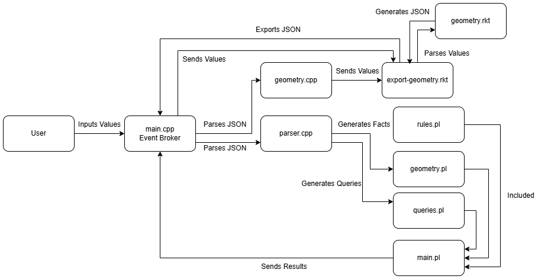

# Geometry Engine Report

## Description

Geometry Engine is a cross-language interpreter and analysis system for users to define points, and then the program creates the segment/polygon, checks the validity of some geometric relations, and allows the user to translate and scale their shape.

## Design Choices

**Language Specialization:**

* Scheme (Racket) defines points and segments.
* C++ performs numerical operations.
* Prolog validates geometric relations.

**Shared Data Format**

* JSON is used for file exchange between Scheme and C++.
* C++ Writes to .pl files for generating the facts and queries used by Prolog.

**Data Flow**

* Geometry facts flow from C++ -> Scheme -> C++ -> Prolog -> C++.

**Generating Geometry Design**

* I decided to split up how racket generates the geometry and how it exports it. export-geometry takes in the values from the command, and then parses them to the geometry functions to actually generate the geometry. Then export-geometry writes the geometry to JSON to be read by C++.

**C++ Client Design**

* The easiest way I could think of integrating all three languages was to have one of them be a client (or broker) that handles calls to the other two languages. 
    * To accomplish this, I thought to make C++ the client for which the user interacts with in order to generate geometry, do calculations, and verify relations.

#### Rule Design

* All except the intersecting segments rules that are used for validation are made to check based on the points facts passed to them making it easer create queries.

## Architecture

I decided to use an event-driven architecture because I wanted to use inputted values from the command line instead of some example json file to start from.

main.cpp is the event broker for the system. Events are triggered by the user inputting values and then depending on the application the broker can send those values to Racket to generate the geometry, or in the case that the user is translating or scaling the geometry, it parses the JSON to be edited.

main.cpp parses the JSON to either the geometry or parser c++ files. The geometry file would send the new values back to Racket to generate a new JSON geometry. The parser file would generate facts and queries based on the JSON passed and send those to the geometry and queries pl files.

Those files are then compiled in main.pl and the results are sent back to main.

## Motivation

The motivation for creating this geometry engine stems from the confidence that I had in making a application that could do all the things I wanted it to do. We had been working on similar projects through the semester in our C++ module working with points, segments, contours, and numerical operations based off of these things, so I was confident in the functionality. 

The difficult part would be how to integrate two other programming languages to accomplish the same kind of application.

I based the functionality of each language off of the example goals for this project; however, the project was still very open ended which sometimes made it difficult but it also made it easier for me to add things because there weren't strict requirements meaning I could implement the features in a way that made sense to me.

I wanted to make this application event driven, because it allows there to be as many possibilities as the user wants. They can create complex polygons or simple segments and test the validity of them all from the same user interface.

## Paradigm Integration

#### Scheme (Racket):

* **geometry.rkt**
    * Defines Points.
    * Points define Segments.
    * Points and Segments define Polygons.
    * Handles JSON conversion for each of these types.

>

* **export-json.rkt**
    * Handles input parsing to geometry.rkt.
    * Handles JSON exporting.

#### C++:

* **geometry.h**
    * Translate user geometry.
    * Scale user geometry.
    * Calculate centroid.
    * Calculate distances and perimeter.
    * *Translate and Scale:* Makes calls to Racket through the system using updated number values from translate and scale functions.

>

* **parser.h**
    * *Facts:* Creates the geometry.pl file prolog file holding the facts about the current geometry (points and segments).
    * *Queries:* Creates the queries.pl file based off the the ruleset given to prolog but with dynamic input values (list the points).

>

* **main.cpp**
    * The client that the user interacts with.
    * Handles user input, verifying numerical values.
        * Lets prolog handle other verification.
    * Updates parsed json through calls to Racket.

#### Prolog:

* **rules.pl**
    * closed_polygon
        * Checks to see if all the segments are connected and the last segment is from the last point to the first point.
    * duplicate_point_values
        * Checks for coordinates given in the geometry file are the same for any pair of coordinates.
    * valid_point_count
        * Checks for at least three points to be considered a polygon.
    * segments_intersect
        * Checks each pair of segments and uses orientation to find out the direction of turn for each triplet of points based off of the pair of segments.
        * "> 0" means it turns left, "< 0" means it turns right, and "= 0" means they all lie on the same line.
    * more_than_two_collinear
        * Makes groups of three points and checks their orientation for "= 0" meaning more than two points are collinear
    * all_collinear
        * Like the previous rule, it checks groups of three points, but instead finds if the area of the the triangle made by those three points is 0 meaning its collinear and then checks those groups of points consecutively so see if the whole shape is on the same line.

>

* **geometry.pl** (generates on make run)
    * C++ populates this file with the facts based on the points and segments.
        * Point(p1, 0, 0)
        * Point(p2, 0, 1)
        * Segment(s1, p1, p2)

>

* **main.pl**
    * Combines rules and geometry for easy compilation. Procedures weren't being recognized depending on the order they were compiled.
    * Handles parsing queries from the queries.pl file onto the rules.pl file using the facts from the geometry.pl file.